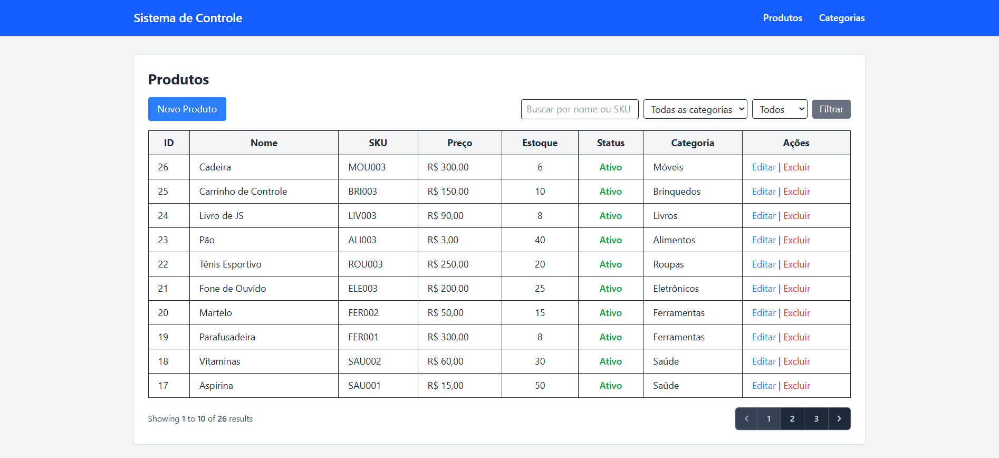
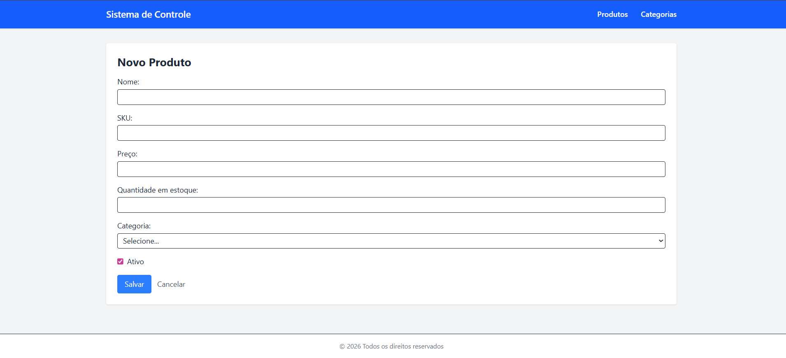
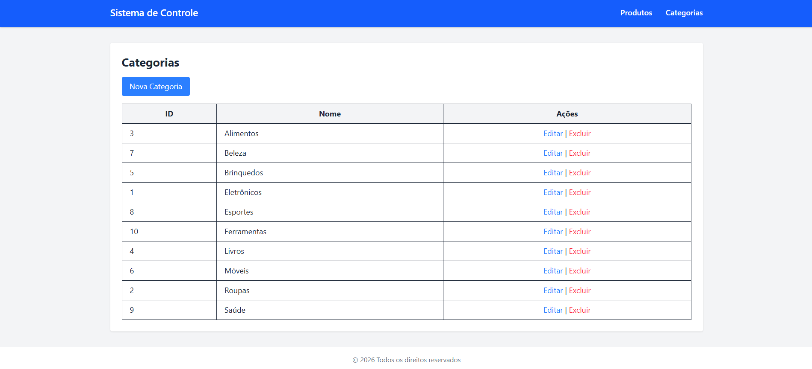
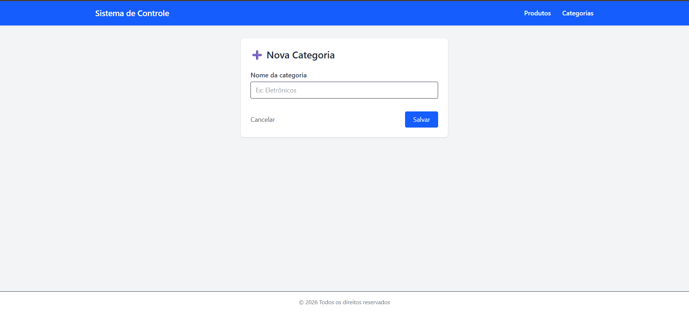

<p align="center">
  <a href="https://laravel.com" target="_blank">
    
  </a>
</p>

<p align="center">
  
  
  
  
</p>

# Sistema de Cadastro de Produtos

Sistema simples de cadastro e gerenciamento de produtos e categorias, desenvolvido como **desafio técnico** utilizando **Laravel 12, Blade, MySQL e Tailwind CSS**.

O projeto possui validações, relacionamento entre entidades, interface estilizada e funcionalidades diferenciais solicitadas no desafio.

---

## Tecnologias Utilizadas

- **Laravel 12**
- **PHP 8.2**
- **MySQL**
- **Blade**
- **Tailwind CSS**
- **Vite**

---

## Funcionalidades

### Produtos
- Listagem de produtos com paginação
- Cadastro, edição e exclusão de produtos
- Validações:
  - Nome obrigatório
  - SKU único
  - Preço > 0
  - Quantidade em estoque ≥ 0
- Relacionamento com categorias
- Busca por nome ou SKU
- Filtro por categoria
- Confirmação antes de excluir
- Soft delete (restauração de produtos)

### Categorias
- CRUD completo de categorias
- Não permite excluir categoria com produtos vinculados
- Validação de nome obrigatório

---

## Screenshots da Aplicação

### Dashboard
<p align="center">
  
</p>

### Cadastro de Novo Produto
<p align="center">
  
</p>

### Listagem de Categorias
<p align="center">
  
</p>

### Cadastro de Nova Categoria
<p align="center">
  
</p>

---

## Como executar o projeto

```bash
# Clonar o repositório
git clone https://github.com/larissa-bonasina/desafio-laravel-produtos.git
cd desafio-laravel-produtos

# Instalar dependências PHP
composer install

# Configurar ambiente
cp .env.example .env
# Ajuste as variáveis do banco de dados MySQL no arquivo .env

# Gerar a chave da aplicação
php artisan key:generate

# Rodar migrations e seeders 
php artisan migrate --seed

# Rodar o servidor local
php artisan serve

# No VSCode rode para Tailwind e Vite
npm install
npm run dev
